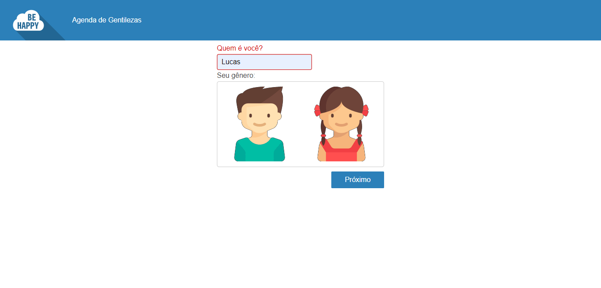

# Be Happy With Me

<br />
<p align="center">
  <a href="https://github.com/lucas-castro-developer/be-happy-with-me">
    
  </a>

  <h3 align="center">BeHappyWithMe</h3>

  <p align="center">
    Um feedback feliz para a pessoa que você mais gosta!
    <br />
    <a href="https://github.com/lucas-castro-developer/be-happy-with-me"><strong>Explore as documentações »</strong></a>
    <br />
    <br />
  </p>
</p>

<details open="open">
  <summary>Conteúdos</summary>
  <ol>
    <li>
      <a href="#sobre-o-projeto">Sobre o projeto</a>
      <ul>
        <li><a href="#construído-com">Construído com</a></li>
      </ul>
    </li>
    <li>
      <a href="#iniciando">Iniciando</a>
      <ul>
        <li><a href="#pré-requisitos">Pré-requisitos</a></li>
        <li><a href="#instalação">Instalação</a></li>
      </ul>
    </li>
    <li><a href="#Contribuição">Contribuição</a></li>
    <li><a href="#Licença">Licença</a></li>
    <li><a href="#Contato">Contato</a></li>
  </ol>
</details>

## Sobre o projeto

O projeto Be Happy With Me tem por objetivo disponibilizar uma ferramenta de feedback feliz para os usuários.

Por hora, a estrutura abarca somente a versão frontend, mas já com a estrutura de PWA implementada.

O usuário pode escolher o nome e o avatar que deseja usar.

Abaixo, segue imagens do layout construído em dispositivos  `mobile` e `desktop`:

**Mobile**


**Desktop**



### Construído com

Este projeto foi construído com o auxílio das seguintes ferramentas
* [HTML](https://developer.mozilla.org/pt-BR/docs/Web/HTML)
* [CSS](https://developer.mozilla.org/pt-BR/docs/Web/CSS)
* [Javascript](https://developer.mozilla.org/pt-BR/docs/Web/JavaScript)
* [ReactJS](https://pt-br.reactjs.org/)
* [Pure.css](https://purecss.io/)

<!-- GETTING STARTED -->
## Iniciando

Para começar a manipular o projeto, siga os passos abaixo:

### Instalação

1. Clone o repositório
 ```sh
 git clone https://github.com/lucas-castro-developer/be-happy-with-me.git
 ```

2. Abra uma instância do seu terminal e entre na pasta `frontend`
 ```sh
 cd frontend
 ```

3. Instale as dependências
 ```sh
 npm install
 ```

4. Primeiro, faça o build dos arquivos codificados usando o comando (este comando deve ser usado toda vez que se faz alguma alteração no código)
 ```sh
 npm run build
 ```
 
4. Após o build, rode o comando abaixo para executar o projeto
 ```sh
 npm start
 ```

5. Pronto. Seu projeto estará funcionando para testes a nível de frontend

## Contribuição

Quer contribuir com este projeto? Então siga os passos abaixo:

1. Realize o fork do projeto
2. Crie sua branch (`git checkout -b feature/AmazingFeature`)
3. Faça o commit das suas modificações/criações (`git commit -m 'Add some AmazingFeature'`)
4. Publique a branch (`git push origin feature/AmazingFeature`)
5. Abra uma Pull Request

## Licença

Este projeto não utiliza nenhum tipo de licença.

## Contato

Lucas dos Santos Castro - [LinkedIn](https://www.linkedin.com/in/lucas-castro-5762a6125/) - lucascastrodeveloper@gmail.com

Project Link: [https://github.com/lucas-castro-developer/be-happy-with-me](https://github.com/lucas-castro-developer/be-happy-with-me)
